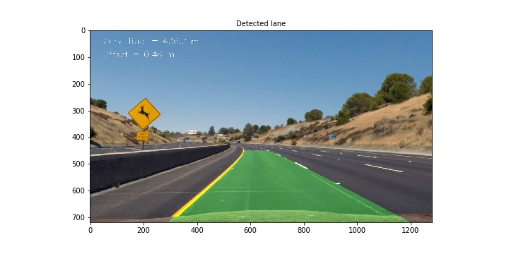

# **Advanced Lane Finding Project**

The goals / steps of this project are the following:

* Compute the camera calibration matrix and distortion coefficients given a set of chessboard images.
* Apply a distortion correction to raw images.
* Use color transforms, gradients, etc., to create a thresholded binary image.
* Apply a perspective transform to rectify binary image ("birds-eye view").
* Detect lane pixels and fit to find the lane boundary.
* Determine the curvature of the lane and vehicle position with respect to center.
* Warp the detected lane boundaries back onto the original image.
* Output visual display of the lane boundaries and numerical estimation of lane curvature and vehicle position.

This writeup is split into 4 parts:

* description of camera calibration
* description of the pipeline and presentation of results on test images
* description of additional features brought to pipeline for video processing, and presentation of results
* Discussion of weaknesses and suggested improvements

[//]: # (Image References)
[image1]: ./camera_cal/calibration6.jpg "Chessboard"
[image2]: ./camera_cal/calibration6_corners.png "corners"
[image3]: ./camera_cal/calibration1.jpg
[image4]: ./camera_cal/calibration4.jpg
[image5]: ./camera_cal/calibration5.jpg
[image6]: ./camera_cal/calibration2.jpg
[image7]: ./camera_cal/calibration2_undist.jpg
[image8]: ./output_images/test2_undist.jpg
[image9]: ./output_images/test2_mask.jpg

## Camera Calibration

The code for this step is contained in the function `calib_camera` of the Python script called `pipeline_functions.py`).  
The calibration is performed using a set of chessboard images provided by Udacity, which can be found in the directory [./camera_cal](). There are 20 images. The chessboard contains 7 rows and 10 columns (see picture below) which means there 6*9=54 corners. Image size is `720x1280`. 
![chessboard][image1]
I start by preparing "object points", which will be the (x, y, z) coordinates of the chessboard corners in the world. Here I am assuming the chessboard is fixed on the (x, y) plane at z=0, such that the object points are the same for each calibration image.  (x,y)-coordinates are equal to (0,0) for the upper left corner. (x,y)-coordinates for the corner located on the _nth_ row, _mth_ column (starting index=0) are equal to (m,n) (image convention is that _x_ goes from left to right, and _y_ from top to down).  `objp` is just a replicated array of coordinates, and `objpoints` will be appended with a copy of it every time I successfully detect all chessboard corners in a test image.  `imgpoints` will be appended with the (x, y) pixel position of each of the corners in the image plane with each successful chessboard detection. 
The corner detection is performed using openCV function `cv2.findChessBoardCorners`. 
On the picture below I plot the detected corners for the chessboard shown previously. This is done using openCV function `cv2.drawChessBoardCorners`.

![corners][image2]

It happens that the detection of corners fails for the 3 following pictures:
![][image3]
![][image4]
![][image5]
Indeed we notice that for these pictures part of the chessboard is cropped. So finally we get 17 pictures which are fine for camera calibration.

I then used the output `objpoints` and `imgpoints` to compute the camera calibration and distortion coefficients using openCV function `cv2.calibrateCamera` function.  
The obtained values are:
| Calibration |matrix|        |
|:--------:|:-----:|:-------:|
|1153.965|0.000|669.708|
|0.000|1148.028|385.661|
|0.000|0.000|1.000|
**Distortion coefficients**:
[-0.241, -0.053, -0.001, -0.000, 0.027]

I applied this distortion correction to one of the calibration image using openCV function `cv2.undistort` function and obtained this result: 

![initial][image6]
![undistort][image7]

We can see that the distortion correction performs well.

Finally we save the intrinsic calibration matrix and the distortion coefficient in a pickle file `calib.p` (using `pickle.dump` function) so that we don't have to perform it every time.

## Pipeline description and application to test images

### 1. Apply distortion correction to images
First we apply the distortion correction to the test images. For this we load the calibration matrix and the distortion matrix we previously computed (using `pickle.load`).
Then we apply the distortion correction using `cv2.undistort` function.
Here is an example of what we get:
![alt text][image8]
We notice how the dashed white line stretches out on the left hand side of the image when we apply distortion correction.

### 2. Create a thresholded binary image
The second step consists in creating a binary image from the input image. The objective is to set to 1 the pixels that are likely to represent lane lines.
Identifying line pixels can be done several ways:

* computing gradients and detecting pixels whose gradient along x and/or gradient along y and/or gradient magnitude and/or gradient direction are within specified ranges (cf. functions `abs_sobel_thresh`, `mag_thresh` and `dir_thresh` in `pipeline_functions.py`)
* using different color spaces (RGB, HSV, HLS, GRAY...) and extracting the pixels whose magnitude for one or several color components is within a given range (cf. function `color_thresh`)

I used a combination of color and gradient thresholds to generate a binary image (see code from lines # to # in `project3.py`. I first compute an "overall" gradient mask (`grad_binary` variable) which is itself a combination of  gradient masks. I tested two combinations: x and y gradients, then magnitude and direction of the gradient. Gradient is computed on grayscale image (I also tested the gradient on the Saturation component and it works fine as well). I finally I chose the second combination:
 
    gradx = abs_sobel_thresh(img_undist, 'x', ksize, (10, 255))
    grady = abs_sobel_thresh(img_undist, 'y', ksize, (50, 255))
    mag_binary = mag_thresh(img_undist, ksize, (50, 255))
    dir_binary = dir_thresh(img_undist, ksize, (40/180.*np.pi, 75/180.*np.pi))

    #grad_binary[((gradx == 1) & (grady == 1))] = 1
    grad_binary[(mag_binary == 1) & (dir_binary == 1)] = 1

I used then two color masks to detect white and yellow lines.
The white color detection consists in converting the image to grayscale and selecting pixels with a magnitude greater than a given threshold.
The yellow color detection consists in converting the color to HLS and selecting pixels whose Hue and Saturation are within given thresholds.

    yel_binary = color_thresh(img_undist, 'HLS', [[18,35],[0,255],[80,255]])
    whi_binary = color_thresh(img_undist, 'GRAY', [[200,255]])

The final mask is then obtained by putting to 1 the indices which  are equal to 1 in at least two out of the 3 pre-masks :

    mask[(whi_binary+yel_binary+grad_binary)>=2]=1

Here's an example of my output for this step. The lefthandside figure is a stack of the three masks plotted with different colors (R->gradient, G->yellow,B->white). The righthandside picture is the combined binary mask.
![mask][image9]

### 3. Perspective transform
The code for my perspective transform includes a function called `rectify_image()` in `pipeline_functions.py`.  The `rectify_image()` function takes as inputs an image (`img`), as well as 4 source (`src`) and 4 destination (`dst`) points.  It uses the openCV functions `cv2.getPerspectiveTransform` and `cv2.warpPerspective` to respectively determine the transformation matrix and warp the image.
The four points define a trapezoidal shape in the source image and are transformed into a rectangular shape in the destination image. Indeed a straight lane is a rectangle when observed from the top, but becomes a trapeze when looked from the car (supposing the road is flat). 
I manually chose the source and destination points. I chose one image with straight lines (straight\_lines1.jpg) and fit a trapeze on the right and left lines (see picture below). I shrinked this width in the destination image so as not to lose the sides of the road. 
This resulted in the following source and destination points:

|Position| Source (x,y)   | Destination (x,y)  | 
|:--:|:-------------:|:------------:| 
|Down left| (210, 720)      | (310, 720)     | 
|Down righ| (1105, 720)     | (1005, 720)     |
| Up right | (685, 450)      | (1005, 0)       |
| Up left | (594, 450)      | (310, 0)       |

I verified that my perspective transform was working as expected by drawing the `src` and `dst` points onto a test image, which has straight lines, and its warped counterpart to verify that the lines appear parallel in the warped image. I also did it on the mask.

### 4. Find the lanes
The code to find the lanes is within a function called `find_lines` in `pipeline_functions.py`.  
There are two different branches in this function, depending on the availability of a priori values in input of the function. In video mode, the a priori values come from the previous image. In addition to the line values, the function also takes a validity flag which indicates if input values can be used.

__First method: no valid values available__

To find the lane from the mask, we proceed in two steps:
1) first compute an histogram of the mask pixels along y-axis. We are expecting to find two peaks whose x-position will be good indicators of the position of the base of the lines. For the straight line image, these two peaks are clearly noticeable as we can see on the next figure:

2) have a sliding window move from the bottom of the image to the top, for each of the two lines, and retrieve positions of non-zero values which are inside the window.
The dimension of the sliding window are the following:

* width: 200
* height: 80

There are then 9 windows stacked vertically in the image.
The principle is the following:

* split image in two parts to isolate right and left lanes
* For right and left sides:
	* 1) Position the window at the base of the image with the x-position derived from the histrogram
	* 2) extract non zero values inside the window and store their (x,y)-coordinates
	* 3) if the number of non zero values is greater than a predefined threshold, compute the x-coordinate of the next window by averaging the x-coordinates ot the non-zero points of the current window
	* 4) repeat from step 2, with next window moved upward by the height of the window, and horizontally centered on the x-coordinate determined at step 3

On the figures below, we can see the positions of the windows on the mask for straight lane case and curved lane case.

Finally we fit a second order polynomial curve on the left and right lines. We are fitting along y-axis because lines are almost vertical and may have the same x-value for several y-values.

__Second method: valid values are available__
If in input we have 3 polynomial coefficients, which define the line position,  we can then search in a margin around the previous line position.
On the figure below we plot the new area of search (for the curved lane image) using as input values the ones we found previously.

It may happen, that only one of the two lines was correctly detected. The two lines are expected to be parallel, we can then using the avaible line to help for the search of the line. We just have to shift x-coordinate of the line by the approximate width of the lane.
On the figure below, we plot the new area of search (for the curved lane image) using only the left line found before. 

### 5. Calculating the curvature of the lane and the position of the vehicle with respect to center
Once we have the second order polynomial curve, it is quite easy to compute the curvature radius . We can show that for a second order polynomial of the form $Ax^2+Bx+C$, it is equal to :

$
			R=(1+(2Ax+B)^2)^{3/2})/(|2A|)
$

We then have to convert the value we get from pixels to meters. For this we use the fact that a lane is 3.7m wide, and that the lane length (in the bird's eye view) is approximately 30m.
We finally average the left and right curvature radii.

As for the position of the vehicle, we assume the camera is mounted at the center of the car, such that the lane center is the midpoint at the bottom of the image between the two lines we have detected. The offset of the lane center from the center of the image (converted from pixels to meters) is the distance from the center of the lane. 

The code for computing curvature radius and center offset can be found in the 8th cell of `image_pipeline.ipynb`.

### 6. Warp the detected lane boundaries back onto the original image and plot them

Finally once we have detected the two lines, we draw a green-shaded area between the two lines in the warped domain. Then we convert it back into the real world using  the openCV function `cv2.warpPerspective` and the inverse of the perspective transformation matrix we determined previously.
We also write the computed curvature radius and the offset from line center.
Below is the result I get on the test image:

## Lane detection on videos

### Adaptation of the pipeline
The code for processing videos can be found in `video_pipeline.ipynb`. The pipeline includes the steps that were presented previously, plus some additional features to make the detection more robust and neater:

* sanity check to reject outliers
* smoothing of the lines
* management of invalid values

We will describe these features later in this section.

In addition the structure of the code was changed. Indeed we introduced a _Lane_ class to keep track of all the interesting parameters we measure from frame to frame. 
This class also contains two functions `load_calibration` and `process_image`, used respectively to load calibration parameters, and perform lane detection on an input image (it contains the pipeline).
This latter function is then called for each image of the video file to process. The following shows how it is implemented :

    from moviepy.editor import VideoFileClip
    calib_dir = './camera_cal/'     # Calibration directory
    video_path = './videos/project_video.mp4'       
    lane = Lane(calib_dir)   	# create lane object
    clip1 = VideoFileClip(video_path)  # load video
    out_clip = clip1.fl_image(lane.process_image) # Process images

### Sanity check to reject outliers
I implemented a sanity check of the estimated polynomial coefficients so as to exclude outliers. The code can be found in the `sanity_check` function of `pipeline_functions.py`. The check is threefold:

* check that a valid polynomial curve was returned bby `find_lines` function (coefficients values must be different than zero)
* check that absolute values of the three coefficients are smaller than specific thresholds
	* the thresholds were found empirically, based on the excursion of the coefficients observed on the project video. I chose the following ones:  [0.001, 1.6, 550]
* check that the difference with previous values (if they were flagged as valid) is less than specific thresholds
	* again the thresholds were found empirically: [0.0005, 0.4, 150]

The function returns a flag indicating if the status of the sanity check.

### Smoothing of the line coefficients
As the estimation of line coefficients is noisy , I implemented a smoothing function (`smooth` function in `pipeline_functions.py`).
I chose a more evolved algorithm than a simple averaging filter to avoid a lagging effect. Instead I implemented a polynomial fitting which has two advantages: no lag is present and we can propagate past values to current time when the line detection is invalid. Drawback is it is computationnaly heavier.
The smooth function takes several arguments in addition to the data to smooth:

* validity flag of the data
* size of the smoothing window
* minimum number of valid points within the window
* maximum number of invalid data samples at the end of the data series. 
This parameter was introduced to limit extrapolation time. Indeed extrapolation turned out to diverge quite quickly.

If the last two criteria are not met, the smoothing is not performed.

After several trials, I found the best parameteres to be :

* second order polynomial fitting
* size of the a window equal to 75 samples (that is 3 s)
* minimum number of points = 50
* maximum number of invalid data samples at the end = 5

The function returns the smoothed data and a flag which indicates if smoothing could be performed.

### Management of invalid values
To manage the cases where the data returned by the smoothed function is invalid, I implemented the following algorithm:

* if **smoothed** values obtained for the other line are valid , take them and re-smooth the data with it
* else if **non smoothed** values obtained for the other line are valid, take them and re-smooth the data with it
* else, do not plot the lines

### Results
Udacity provided three videos to perform the lane detection. We were required to achieve lane detection only on the first one (project_video.mp4) to pass the project. The two other ones were only for test and were more challenging.

Ouput videos can be found in the _./output\_videos_ directory. 
Regarding project_video.mp4, except two situations where the lines wobble a bit, the detected lane matches really well the real one and evolves smoothly along the video.
On the figure below, we plot the estimated polynomial coefficients versus time for left and right lines. The smoothed coefficients are superimposed.
We also plot the validity flags for raw and smooth data (respective outputs of `find_line` and `smooth` functions).

As for the second video (challenge\_video\_output.mp4), the lane detection fails most of the time. The algorithm has a real problem to detect the left line whereas it makes quite a good job detecting the right one.
As we can see on the figure below, during the second part of the video, the algorithm fails to detect the left line and thus replicate the right line which is valid. However a pure duplication of coefficients is not fully appropriate as we can see on the video.

As for last video (harder\_challenge_video\_output.mp4), the result is a complete miss. The algorithm is really not robust to change of luminosity and tight turns.

## Discussion

In this paragraph, I will present the identified weaknesses of my pipeline and how I might improve it if I were going to pursue this project further.  

|  Weakness  | Suggested improvement |
|:----------:|:------------------:|
| Sensitivity to road slope | Perspective transform should take into account the slope. This requires extra information to determine the slope. |
| Mask not robust enough | Additional masks should be combined together. Gradient masks could be computed on more color components (yellow, white, saturation...)
| Does not cope with tight turns | Sanity check and smoothing parameters were estimated to work on the project video but may not be adapted to other situations. Coefficients excursion thresholds should be increased to cope with tight turns. Order of the polynomial smoothing could be increased to cope with sharper variations. |
| Duplication of other line coefficients | The lane width is currently fixed. Could be updated in real time depending on the observed situation. |
| Smoothing technique ? | Other techniques should be assessed.

